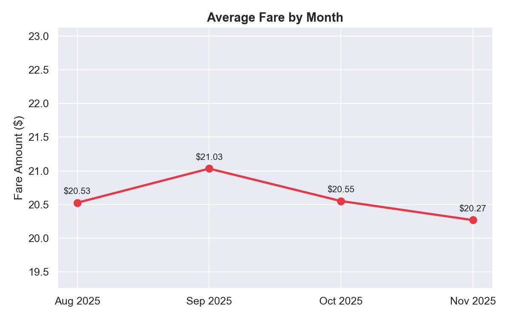
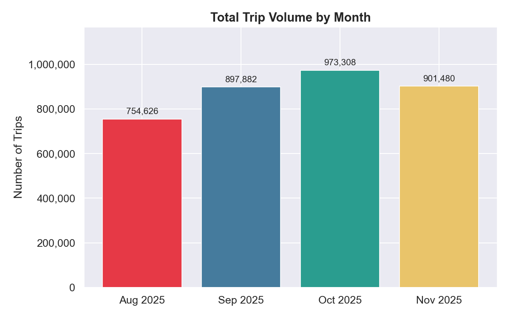
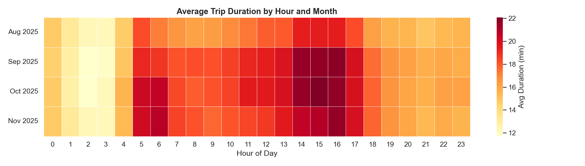
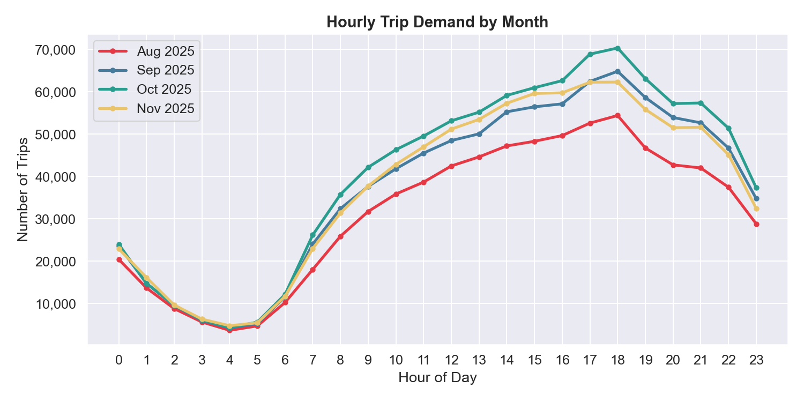
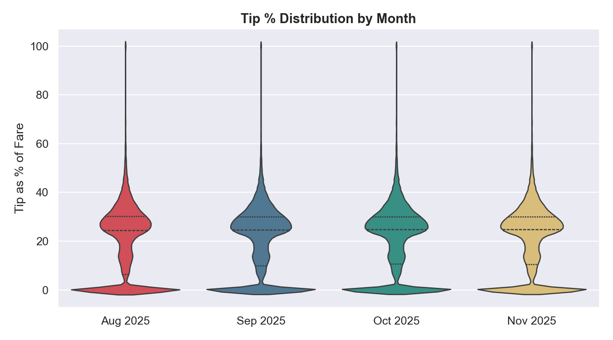

# NYC Taxi Data Project

An end-to-end data pipeline and analysis project using **PySpark** and **Python** to process, explore, and visualize NYC Yellow Taxi trip data from August to November 2025.

---

## Project Structure
```
NYC-Taxi-Data-Project/
├── data/
│   ├── raw/                  # Original .parquet files
│   └── processed/            # Cleaned .csv outputs
├── scripts/
│   ├── extract.py            # PySpark pipeline: load, clean, explore, save
│   └── visualization.py      # Cross-month visualizations using Matplotlib & Seaborn
├── outputs/
│   └── charts/               # Generated chart images
└── README.md
```

---

## Pipeline Overview (`extract.py`)

The pipeline loads raw `.parquet` files using PySpark and performs the following steps:

- Computes `trip_duration_minutes` from pickup and dropoff timestamps
- Filters out invalid trips (zero distance, negative fares, unrealistic durations)
- Explores the cleaned data using PySpark aggregations, window functions, and SQL queries
- Saves a 30% sample of the cleaned data as a `.csv` for visualization

### PySpark Exploration Highlights

**Basic aggregations** — average trip distance by passenger count, fare and tip by hour of day, payment type distribution, and top 10 longest trips.

**Window functions** — ranks the top 3 busiest pickup hours within each day using `rank()` over a date partition. This identifies peak demand periods at a daily level rather than just an overall average.

**Multi-aggregation** — a single `groupBy` on payment type returning trip count, average fare, average tip, and average distance together.

**SQL interface** — registers the DataFrame as a temp view and queries it with `spark.sql()`, identifying the top 10 busiest hours across all trips.

**Bucketizer** — bins trips into distance categories (Short / Medium / Long / Very Long) using `pyspark.ml.feature.Bucketizer` and compares average fares and tips across buckets.

### Notes on Running the Pipeline

- PySpark is configured with `spark.driver.memory = 4g` to handle large datasets on a local machine
- The full dataset exceeds Excel's row limit (~1M rows) — this is expected and intentional
- A 30% sample is saved for visualization; the full pipeline processes all rows
- On Windows, the output is saved via `toPandas().to_csv()` to avoid Hadoop/winutils requirements

---

## Visualizations (`visualization.py`)

Loads cleaned `.csv` files for all four months and generates cross-month comparisons.

### Average Fare Trend


Average fares remain remarkably stable across all four months, ranging narrowly from $20.27 to $21.03. Fares peak in September at $21.00 before gradually declining through October and November. The consistency suggests NYC taxi pricing is not heavily influenced by season, at least over this four month window.

### Total Trip Volume by Month


Trip volume peaks in October and is notably lower in August. One possible explanation is that August is a summer month where people may be more inclined to walk or bike, while the cooler fall months push more riders toward taxis. It is also worth noting that October's volume makes it the busiest month in this dataset despite fares being slightly lower than September.

### Average Trip Duration Heatmap


This is the most visually interesting chart in the project. The longest average trip durations consistently appear around **hour 5** and again around **hours 15–16** across all four months. The early morning spike at hour 5 likely reflects airport runs or long cross-borough trips with very little traffic. The mid-afternoon spike around 3–4pm aligns with the start of rush hour — trips are either longer due to heavy traffic, or passengers are travelling greater distances to reach workplaces or transit hubs. The pattern is consistent month over month, suggesting it is structural rather than seasonal.

### Hourly Trip Demand


Demand follows a very predictable daily pattern across all four months. Trip volume bottoms out overnight between hours 1–6, then climbs steadily through the morning. Demand peaks sharply in the **late afternoon between hours 15–19**, coinciding with the end of the standard workday. The consistency across months reinforces that commuter behaviour is the primary driver of NYC taxi demand rather than weather or season.

### Tip Percentage Distribution


Tip percentages are largely consistent across all four months, with the bulk of tips falling in a predictable range. August shows a slightly narrower body in the violin shape, suggesting marginally less variability in tipping behaviour during the summer, possibly reflecting more consistent rider behaviour, such as tourists who tend to follow the suggested tip prompts on the payment screen rather than choosing a custom amount.. A notable finding is the number of trips with tip percentages between 60–100%, which are surprising but likely reflect short, cheap rides where even a small dollar tip becomes a high percentage of the fare. A box plot was initially used here but was switched to a violin plot because the volume of rows caused the outlier markers to overwhelm the chart, making the distribution impossible to read.

---

## Requirements
```
pyspark
pandas
matplotlib
seaborn
```

Install with:
```bash
pip install pyspark pandas matplotlib seaborn
```

---

## Windows Notes

- Saving output uses `toPandas().to_csv()` to avoid the need for Hadoop or `winutils.exe`
- If using PySpark on Windows and Hadoop errors appear, either install winutils or use the `toPandas()` approach as done here
- For datasets over 1GB, ensure `spark.driver.memory` is set to at least `4g`

## Data & Output Files

The processed `.csv` files for August, September, and November 2025 are included in this repository. The October 2025 output (`clean_taxi_data_2025-10.csv`) exceeds GitHub's 100MB file size limit and is excluded from the repo, but can be regenerated locally by running `extract.py` with the corresponding raw `.parquet` file placed in `data/raw/`.
